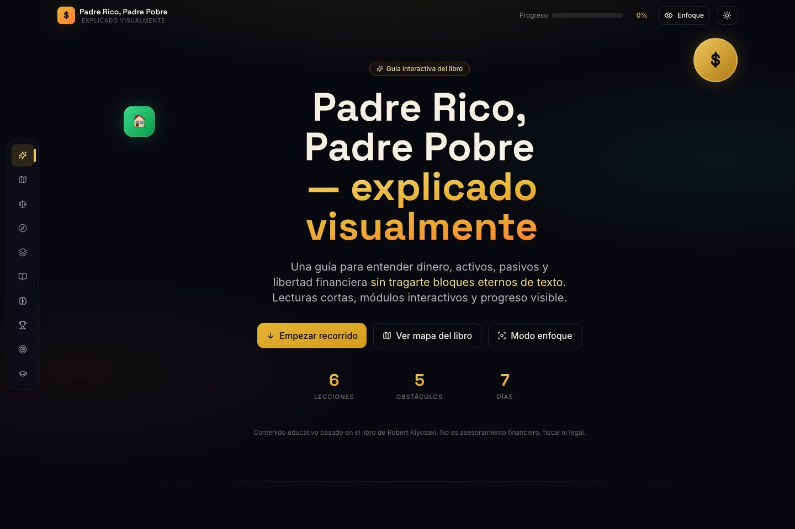

# Padre Rico, Padre Pobre - Guia interactiva

Una experiencia web educativa basada en las ideas principales de **Padre Rico, Padre Pobre**. Esta guia convierte conceptos financieros en bloques visuales, cortos e interactivos: comparadores, simuladores, quiz, glosario y un plan de accion de 7 dias.

[Ver la pagina en GitHub Pages](https://diegoalegil.github.io/padre-rico-padre-pobre/)



## Lo Que Incluye

- Mapa del libro con capitulos y tiempos estimados.
- Comparador de mentalidad entre Padre Rico y Padre Pobre.
- Simulador de carrera de ratas con sliders.
- Clasificador interactivo de activos y pasivos.
- Resumen de las 6 lecciones con ejemplos y mini retos.
- Obstaculos mentales, quiz, plan de 7 dias y glosario visual.
- Modo claro/oscuro, modo enfoque y progreso persistente con `localStorage`.

## Stack

- React 18 + Vite
- Tailwind CSS
- Framer Motion
- Lucide React
- GitHub Actions + GitHub Pages

## Desarrollo Local

```bash
cd padre-rico-web
npm install
npm run dev
```

La app queda disponible en `http://localhost:5173`.

Para generar la build de produccion:

```bash
cd padre-rico-web
npm run build
npm run preview
```

## Estructura

```text
.
├── .github/workflows/      # Despliegue automatico a GitHub Pages
├── docs/                   # Capturas y assets del README
├── padre-rico-web/         # Aplicacion React
│   ├── src/
│   │   ├── components/     # Secciones interactivas de la web
│   │   ├── context/        # Estado global de tema, enfoque y progreso
│   │   ├── data/           # Contenido estructurado
│   │   ├── App.jsx
│   │   └── main.jsx
│   ├── index.html
│   ├── package.json
│   └── vite.config.js
└── README.md
```

## Despliegue

Cada push a `main` ejecuta el workflow `Deploy GitHub Pages`, instala dependencias, genera `padre-rico-web/dist` y publica la pagina en GitHub Pages.

## Aviso

Este proyecto tiene finalidad educativa. No constituye asesoramiento financiero, fiscal ni legal.
